<h1 align="center">LifeArmour HUD</h1>

    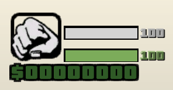

    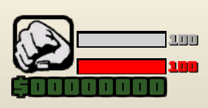
    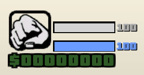
    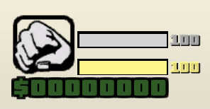
    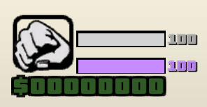

**Este sistema de barras de `Vida y Chaleco` añade un HUD dinámico al servidor que muestra en tiempo real la salud y la protección del jugador. Al `spawnear`, cada usuario recibe dos indicadores: una barra de vida y una barra de chaleco, acompañadas de textdraws que reflejan el valor `numérico exacto`. El sistema detecta automáticamente los cambios en salud y armadura, actualizando las barras mediante un temporizador para mantener un rendimiento estable y fluido.**

**Los jugadores pueden personalizar la apariencia de sus barras (`vida y chaleco`) a través de un menú de selección de `colores`, con opciones que incluyen tonos `clásicos` y variantes `pastel` (rojo, verde, azul, amarillo, morado, cyan, naranja y blanco). Cuando el chaleco se reduce a `cero`, la barra y su indicador se ocultan, reapareciendo únicamente cuando el jugador vuelve a tener protección.**

**Gracias a estas funciones, el sistema ofrece una experiencia visual moderna y configurable: cada jugador puede adaptar el `HUD` a su estilo, mientras que el servidor mantiene un control eficiente sobre la actualización de los valores.**

## Comandos

  `/colorvida` - Abre la lista de colores disponibles para la barra de vida y su valor numérico!  
  `/colorarmour` - Abre la lista de colores disponibles para la barra de chaleco y su valor numérico!  

## 🎨 Colores (Barra de Chaleco) - [Imagenes]

**Explicación: Barra de Chaleco modificado a algunos colores de la lista disponible!**  

---

    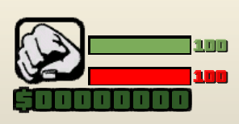
    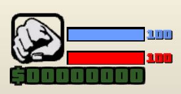
    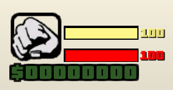
    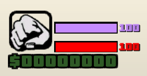
    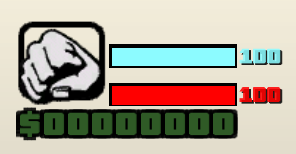
    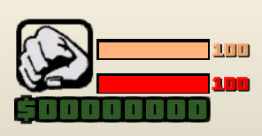
    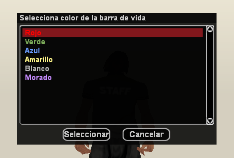
    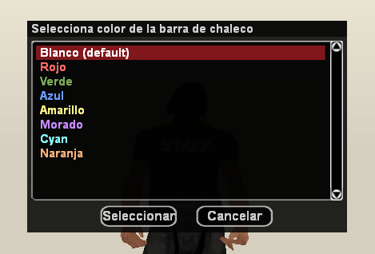

## Aclaración

**Puede modificar o ajustar cualquier parte del sistema si lo necesita, añadir más colores, modificar las barras y ampliar las funciones. También puede corregir textos, mejorar las funciones o agregar detalles que crea útiles. Así podrá adaptarlo mejor a su proyecto o a la forma en que prefiera que funcione el sistema.**

## Creditos

- Desarrollador -> **(Straydet)**
